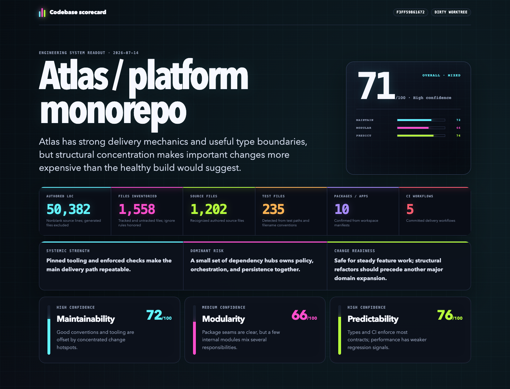

# Codebase Scorecard

An evidence-backed Agent Skill that audits an entire codebase across three engineering pillars and eleven operational categories, then produces a standards-backed improvement plan and a self-contained dark-neon HTML report.



## Install

Install globally for Codex and Claude Code:

```bash
npx skills add mweisberg21/codebase-scorecard \
  --skill score-codebase \
  --global \
  --agent codex \
  --agent claude-code \
  --yes
```

Or use the interactive installer:

```bash
npx skills add mweisberg21/codebase-scorecard
```

Restart Codex or open a fresh Claude Code session after installation.

## Use

Invoke the skill directly. In Codex:

```text
$score-codebase
```

In Claude Code:

```text
/score-codebase
```

You can also ask your agent to audit the current repository, establish a technical-debt baseline, compare two revisions, or generate an engineering health scorecard.

The audit scores:

- Maintainability
- Modularity
- Predictability

Across:

1. Type Safety
2. Architecture
3. Security
4. Data & Persistence
5. Error Handling
6. Code Consistency
7. Build & Tooling
8. Performance
9. Structural (God Files)
10. Testing & CI
11. Observability & Operations

The categories are stack-agnostic: Type Safety covers TypeScript, mypy/pyright, Go, Rust, and similar type systems; Data & Persistence covers any database or ORM (Supabase, PostgreSQL, Prisma, and others); Performance covers client, server, and worker surfaces; Observability & Operations covers logging, metrics, tracing, alerting, and deploy/rollback safety for anything the team operates. Categories that genuinely do not apply are marked N/A and excluded from the averages.

## Output

The skill produces:

- a concise decision-ready TL;DR in chat;
- a repository-scale readout with authored LOC, files, source, tests, and other confirmed counts;
- a reproducible 33-cell score matrix;
- evidence-linked findings and confidence levels;
- standards-backed improvements with a target state, first slice, completion test, and verification path;
- a self-contained responsive HTML report;
- explicit coverage and limitations.

The audit is read-only unless you separately ask the agent to implement improvements.

## Update

```bash
npx skills update score-codebase --global --yes
```

## Requirements

- An Agent Skills-compatible coding agent
- Node.js 18 or newer for the `skills` installer
- Python 3.10 or newer when running the bundled inventory, scoring, and report scripts

The report generator uses only the Python standard library and does not load external assets at runtime.

## License

[MIT](LICENSE)
